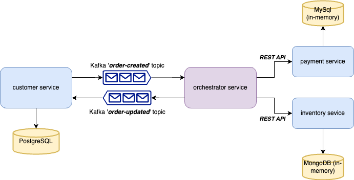

### About the Application
This Spring application was created to gain practical experience with the Saga Orchestration pattern. 
It uses Spring Boot as an application core, Kafka for event-driven communication between services, and PostgresDB for data storage.     




### Inspired by:
[Orchestration Saga Pattern With Spring Boot](https://www.vinsguru.com/orchestration-saga-pattern-with-spring-boot)    
[MicroServices – How To Share DTO](https://www.vinsguru.com/microservices-architecture-how-to-share-dto-data-transfer-objects/)    
[Spring Data R2DBC CRUD](https://www.vinsguru.com/spring-data-r2dbc/)    
[Reactive programming with Spring Data R2DBC](https://medium.com/pictet-technologies-blog/reactive-programming-with-spring-data-r2dbc-ee9f1c24848b)    
[Apache Kafka](https://hub.docker.com/r/apache/kafka)    
[Gradle Multi-Project Build](https://docs.gradle.org/current/userguide/intro_multi_project_builds.html)


### Building services:
1. To build order-service execute command below from root directory `sagaLab`
   `docker build --progress=plain --no-cache -t order-service -f ./order-service/Dockerfile .`
2. To build order-service execute command below from root directory `sagaLab`
   `docker build --progress=plain --no-cache -t inventory-service -f ./inventory-service/Dockerfile .`
3. To build order-service execute command below from root directory `sagaLab`
   `docker build --progress=plain --no-cache -t payment-service -f ./payment-service/Dockerfile .`
4. To build order-service execute command below from root directory `sagaLab`
   `docker build --progress=plain --no-cache -t orchestrator-service -f ./orchestrator-service/Dockerfile .`


### Starting all services
To start all the services execute command below from root directory `sagaLab`
```
docker-compose build 
docker-compose up -d
```
or
```
docker-compose up --build -d
```


### Testing
To create an order send request
```java
POST http://localhost:8091/order/create
Content-Type: application/json

{
   "userId": 1,
   "productId": 1
}
```